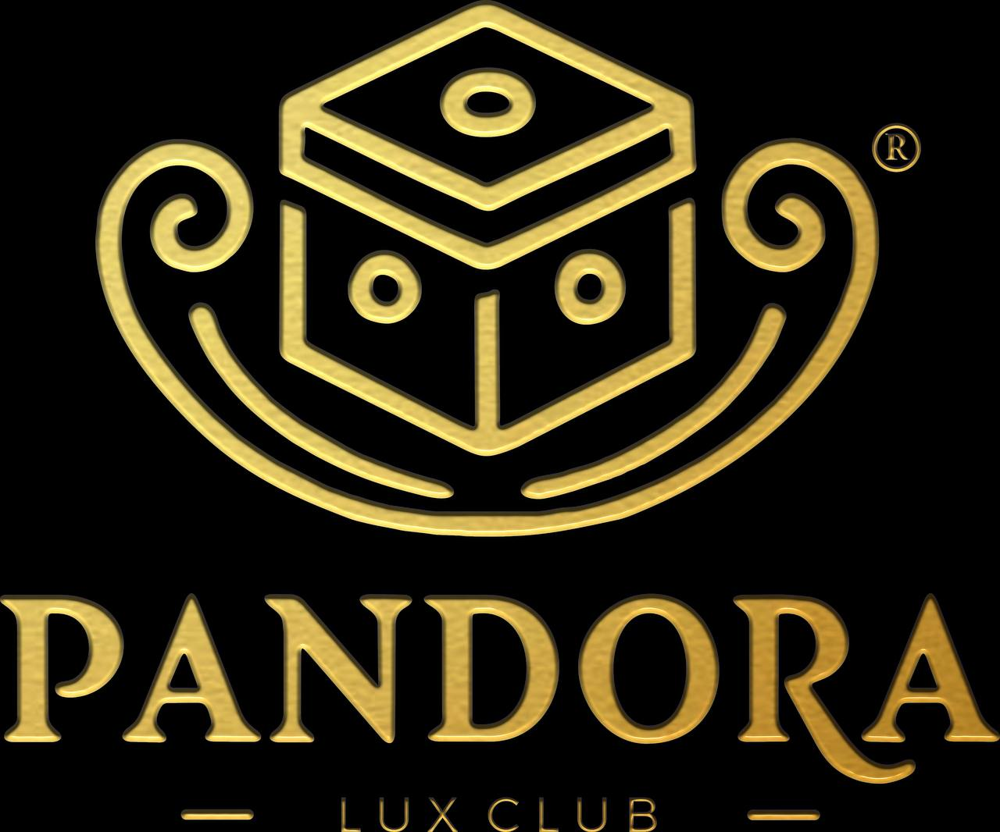

# 🌟 Club Pandora - Página Oficial



## 🎭 Sobre el Proyecto

**Club Pandora** es la página web oficial del club más exclusivo de Palma de Mallorca. Una experiencia digital premium que refleja la elegancia, sofisticación y exclusividad que caracteriza al establecimiento.

### ✨ WHERE BEAUTY MEETS ELEGANCE

---

## 🚀 Características Principales

### 🎨 Diseño Premium
- **Diseño responsive** adaptado a todos los dispositivos
- **Paleta de colores dorada** que refleja exclusividad
- **Animaciones suaves** y efectos visuales sofisticados
- **Tipografía elegante** con Playfair Display y Open Sans

### 📱 Secciones Principales
1. **🏠 Inicio** - Hero con branding principal
2. **🏛️ Lugar** - Descripción del espacio exclusivo
3. **👑 Chicas** - Presentación del equipo premium
4. **📍 Ubicación** - Localización y contacto
5. **📅 Calendario** - Eventos y fechas especiales
6. **🎯 Servicios** - Paquetes VIP y experiencias
7. **🎫 Entradas** - Sistema de compra de tickets

### 🛠️ Tecnologías Utilizadas
- **HTML5** semántico y accesible
- **CSS3** con Grid, Flexbox y animaciones
- **JavaScript vanilla** para interactividad
- **Font Awesome** para iconografía
- **Google Fonts** para tipografía premium

---

## 🎭 Paleta de Colores

```css
/* Colores principales */
--dorado-principal: #d4af37
--dorado-claro: #ffd700
--negro-elegante: #1a1a1a
--gris-oscuro: #2d2d2d
--blanco-puro: #ffffff

/* Gradientes */
background: linear-gradient(135deg, #d4af37 0%, #ffd700 100%)
background: linear-gradient(135deg, #1a1a1a 0%, #2d2d2d 100%)
```

---

## 📂 Estructura del Proyecto

```
club-pandora-oficial/
├── 📄 index.html          # Página principal
├── 📁 css/
│   └── 📄 styles.css      # Estilos principales
├── 📁 js/
│   └── 📄 main.js         # Funcionalidades JavaScript
├── 🖼️ pandoralogo.jpeg    # Logo oficial del club
└── 📖 README.md           # Documentación
```

---

## 🚀 Instalación y Uso

### 📋 Requisitos Previos
- Navegador web moderno
- Servidor local (opcional para desarrollo)

### ⚡ Inicio Rápido

1. **Clonar el repositorio**
```bash
git clone https://github.com/[tu-usuario]/club-pandora-oficial.git
cd club-pandora-oficial
```

2. **Abrir en navegador**
```bash
# Método 1: Abrir directamente
open index.html

# Método 2: Con servidor local (Python)
python -m http.server 8000
# Visitar: http://localhost:8000

# Método 3: Con Live Server (VS Code)
# Instalar extensión Live Server y clic derecho -> Open with Live Server
```

---

## 🎯 Funcionalidades

### 🧭 Navegación Inteligente
- **Menú sticky** que se mantiene visible al hacer scroll
- **Enlaces ancla** para navegación suave entre secciones
- **Menú hamburguesa** responsive para dispositivos móviles
- **Indicadores visuales** del estado activo

### 🎪 Interacciones Premium
- **Animaciones de entrada** al hacer scroll
- **Efectos hover** en elementos interactivos
- **Modales informativos** para eventos
- **Sistema de notificaciones** para acciones
- **Loading screens** elegantes

### 🛒 Sistema de Entradas
- **Tres niveles de acceso**: General, Premium, VIP
- **Información detallada** de cada paquete
- **Botones de compra** integrados
- **Indicadores de popularidad** y ofertas especiales

### 📱 Responsive Design
- **Mobile First** approach
- **Breakpoints optimizados** para tablet y desktop
- **Imágenes adaptativas** según dispositivo
- **Menú colapsible** en pantallas pequeñas

---

## 🎨 Personalización

### 🎭 Colores y Branding
```css
/* Personalizar colores principales en css/styles.css */
:root {
    --primary-gold: #d4af37;
    --secondary-gold: #ffd700;
    --dark-bg: #1a1a1a;
    --light-bg: #2d2d2d;
}
```

### 📝 Contenido
- Editar textos en `index.html`
- Actualizar información de contacto
- Modificar eventos en la sección calendario
- Personalizar servicios y precios

### 🖼️ Imágenes
- Reemplazar `pandoralogo.jpeg` con tu logo
- Agregar imágenes del local en las secciones correspondientes
- Optimizar imágenes para web (formato WebP recomendado)

---

## 🌟 Demo en Vivo

🔗 **[Ver Demo](https://[tu-usuario].github.io/club-pandora-oficial/)**

---

## 📞 Información del Club

### 📍 Ubicación
**Carrer Jaume Ferrer, 8**  
07013 Palma, Mallorca

### ⏰ Horarios
**Lunes - Domingo:** 22:00 - 06:00  
*Horarios especiales en eventos*

### 📱 Contacto
- **Reservas VIP:** +34 971 PANDORA
- **WhatsApp:** +34 666 XXX XXX
- **Email:** info@clubpandora.com

### 🌐 Redes Sociales
- 📸 **Instagram:** @clubpandoramallorca
- 📘 **Facebook:** Club Pandora Mallorca
- 🐦 **Twitter:** @PandoraClubPMI

---

## 🛠️ Desarrollo

### 🐛 Reportar Issues
Si encuentras algún problema o tienes sugerencias, por favor:
1. Revisa los [issues existentes](../../issues)
2. Crea un nuevo issue con detalles específicos
3. Incluye capturas de pantalla si es relevante

### 🤝 Contribuir
1. Fork el repositorio
2. Crea una rama para tu feature (`git checkout -b feature/nueva-funcionalidad`)
3. Commit tus cambios (`git commit -m 'Agregar nueva funcionalidad'`)
4. Push a la rama (`git push origin feature/nueva-funcionalidad`)
5. Abre un Pull Request

---

## 📄 Licencia

Este proyecto está bajo la Licencia MIT. Ver el archivo `LICENSE` para más detalles.

---

## 🏆 Créditos

**Desarrollado con 💎 para Club Pandora**

- **Concepto:** Elegancia y exclusividad digital
- **Diseño:** UI/UX premium orientado a experiencias de lujo
- **Desarrollo:** HTML5, CSS3, JavaScript vanilla
- **Optimización:** Performance y SEO

---

## 📈 Roadmap

### 🚀 Próximas Funcionalidades
- [ ] 🎫 Sistema de reservas online completo
- [ ] 💳 Integración de pagos (Stripe/PayPal)
- [ ] 🗺️ Mapa interactivo con Google Maps
- [ ] 📧 Newsletter y sistema de notificaciones
- [ ] 🌍 Versión multiidioma (ES/EN/DE)
- [ ] 📊 Panel de administración
- [ ] 🔐 Área de miembros VIP

### 🎯 Mejoras Técnicas
- [ ] ⚡ Implementar PWA (Progressive Web App)
- [ ] 🖼️ Lazy loading para imágenes
- [ ] 📱 Push notifications
- [ ] 🔍 Optimización SEO avanzada
- [ ] 📈 Google Analytics integration
- [ ] 🚀 CDN para assets estáticos

---

**🌟 WHERE BEAUTY MEETS ELEGANCE 🌟**

> *Experiencia digital premium para el club más exclusivo de Mallorca*
